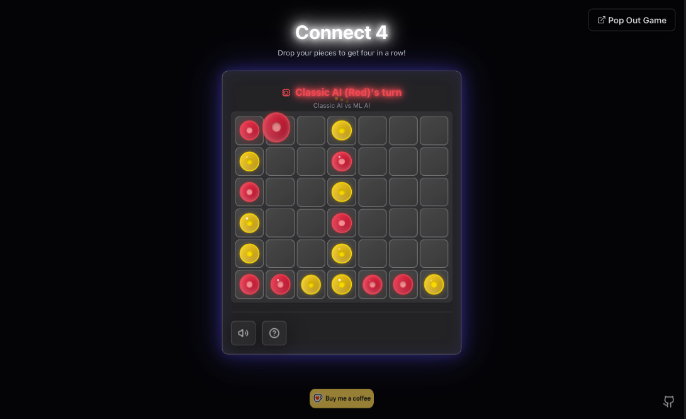

# Connect Four

A Connect Four game with a Rust/WebAssembly AI that runs entirely in the browser — a static Next.js 15 site on Cloudflare.

**Play it: [connect-4.tre.systems](https://connect-4.tre.systems/)**



## Features

- **Two AI opponents**, both compiled from Rust to WebAssembly and run client-side:
  - **Bitboard solver** — negamax + alpha-beta over a 64-bit [bitboard](https://github.com/denkspuren/BitboardC4), with genetically-evolved evaluation weights.
  - **ML-MCTS** — [AlphaZero](https://en.wikipedia.org/wiki/AlphaZero)-style [Monte Carlo Tree Search](https://en.wikipedia.org/wiki/Monte_Carlo_tree_search) over a 4×128 value/policy network.
- **Human vs AI** and **AI vs AI** ("Watch Mode").
- **Offline-first PWA** — fully playable once loaded; moves never hit a server.
- Responsive UI (React 19, Tailwind, Framer Motion).

## Quick start

```bash
npm install
npm run build:wasm-assets   # compile the Rust AI to WASM + copy model assets
npm run dev                 # http://localhost:3000
```

Requires Node 20+, Rust + Cargo, and [`wasm-pack`](https://github.com/rustwasm/wasm-pack) (`cargo install wasm-pack`).

## Commands

| Command                                   | Description                                               |
| ----------------------------------------- | --------------------------------------------------------- |
| `npm run dev`                             | Dev server (Turbopack)                                    |
| `npm run build`                           | Static production build (→ `out/`)                        |
| `npm run check`                           | Full gate: lint, type-check, Rust AI tests, coverage, e2e |
| `npm run test` / `test:e2e` / `test:rust` | Vitest unit / Playwright e2e / cargo tests                |
| `npm run test:ai-comparison:fast`         | AI strength matrix (Rust)                                 |
| `npm run deploy`                          | Build + deploy the static site via Wrangler               |

## Architecture

- **Frontend** — Next.js 15 / React 19; state in Zustand + Immer.
- **AI engine** — Rust compiled to WebAssembly (`worker/`), instantiated and run on the main thread in the browser.
- **Persistence** — current game state in `localStorage`. No server or database.
- **Hosting** — a static site (Next.js `output: 'export'`) served by Cloudflare Workers Static Assets. No server code, no cold starts.

See **[docs/ARCHITECTURE.md](docs/ARCHITECTURE.md)** for the system design, patterns, and diagrams, and **[docs/AI-SYSTEM.md](docs/AI-SYSTEM.md)** for the AI engine.

## Deployment

Pushing to `main` runs the full `npm run check` gate in [CI](.github/workflows/deploy.yml) and, if green, deploys the static `out/` to Cloudflare via `wrangler deploy`.

## Documentation

- [docs/ARCHITECTURE.md](docs/ARCHITECTURE.md) — system design, patterns, diagrams
- [docs/AI-SYSTEM.md](docs/AI-SYSTEM.md) — solver, neural network, training
- [docs/BACKLOG.md](docs/BACKLOG.md) — known gaps and planned work
- [AGENTS.md](AGENTS.md) — coding conventions for this repo

## License

[MIT](LICENSE)
