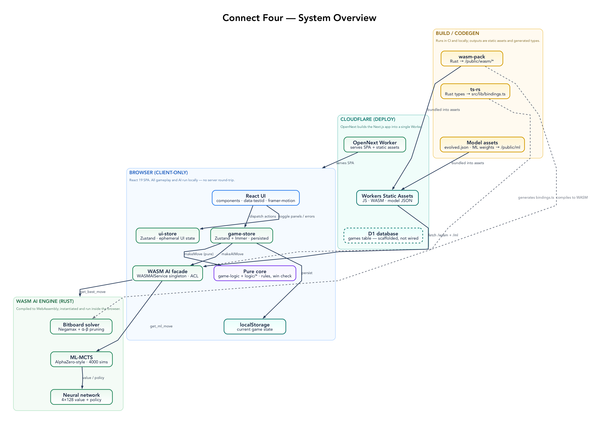
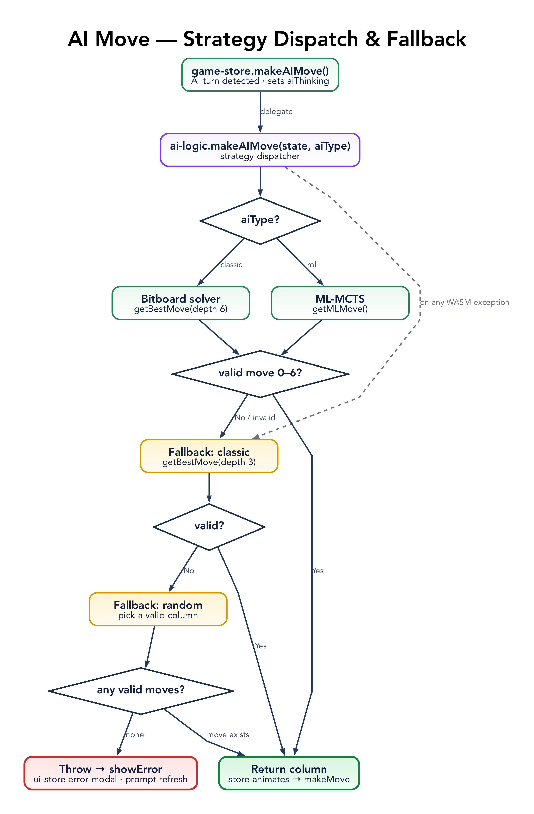
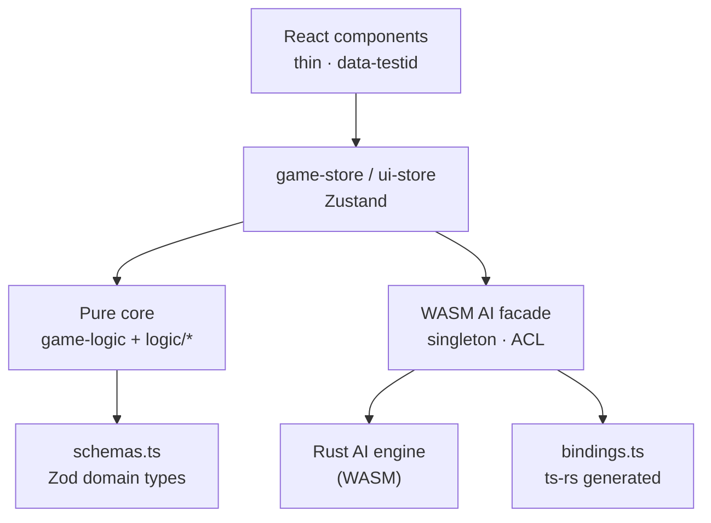
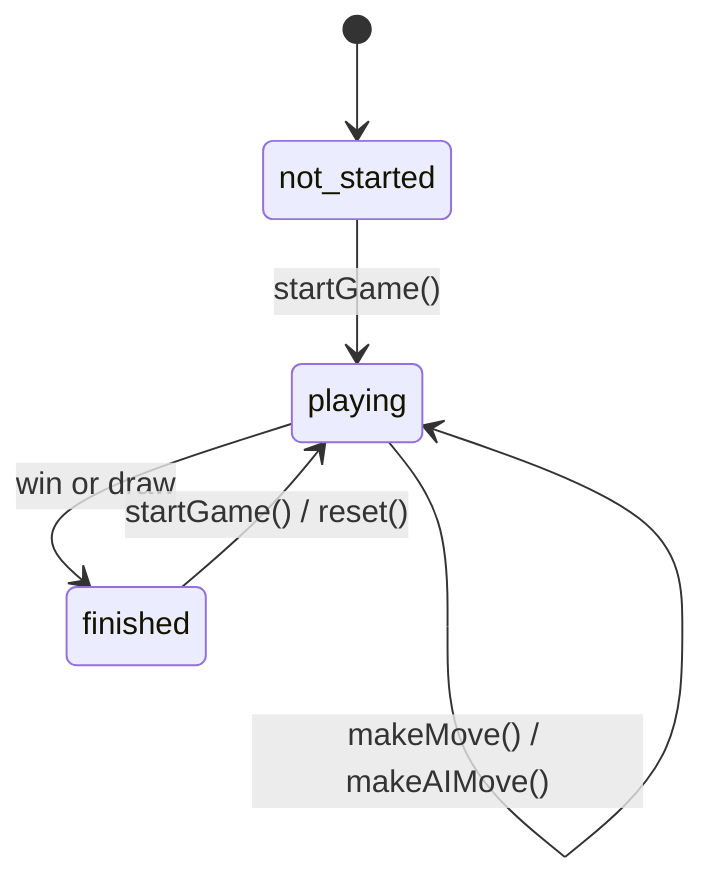

# Architecture Overview

This document details the architecture of the Connect Four project, focusing on its AI engine, frontend, deployment, and infrastructure.

## Diagrams

Two rendered views live in [`docs/diagrams/`](diagrams/) (Graphviz sources + committed PNGs — run `npm run diagrams` to regenerate). Graphviz is used for the dense views; smaller diagrams are inline Mermaid further down.

- **System overview** — the whole client / build / Cloudflare / WASM-engine shape:

  

- **AI move — strategy dispatch & fallback** — how a move is chosen and how the fallback ladder degrades:

  

## What Makes This Special?

This implementation stands out for several reasons:

- **Classic Game, Modern Tech**: Brings the timeless Connect 4 game to life with cutting-edge web technologies
- **Dual AI System**: Features both a classic minimax AI and a neural network AI, each with distinct playstyles
- **Browser-Native AI**: All AI runs locally in your browser via WebAssembly - no server calls needed
- **Offline-First**: Works completely offline once loaded, perfect for mobile or unreliable connections
- **Performance**: Rust-compiled AI provides desktop-level performance in the browser
- **Evolutionary Architecture**: Successfully migrated from hybrid client/server AI to pure client-side execution

## Core Principles

- **High Performance**: Rust and WebAssembly for AI
- **Offline Capability**: Fully playable without internet
- **Seamless UX**: Modern, responsive UI
- **Maintainability**: Clear separation of UI, logic, and AI

## System Architecture

### Frontend (`src/`)

- **UI Components**: `src/components/` (React 19, Tailwind, Framer Motion)
- **Game State**: `src/lib/game-store.ts` (Zustand + Immer, persisted to `localStorage`)
- **UI State**: `src/lib/ui-store.ts` (Zustand)
- **Game Logic**: `src/lib/game-logic.ts` and `src/lib/logic/` (pure functions)
- **AI Services**: `src/lib/wasm-ai-service.ts` (loads the WASM module; handles Classic and ML AI)
- **Persistence layer**: `src/lib/db/` (Drizzle schema + D1/SQLite connector — see "Database System" below)

### AI Engine

- **Classic AI**: Rust, minimax with alpha-beta pruning, compiled to WebAssembly
- **ML AI**: Rust, neural network, compiled to WebAssembly
- **Performance**: All AI runs locally in the browser (no server calls)
- **Architecture**: Pure client-side execution. The WASM module is loaded and called on the main thread (there is no dedicated Web Worker today — the ML-MCTS search blocks for ~2–4s, which is why the store wraps AI moves in `setTimeout` to keep the UI painting). Offloading the engine to a Web Worker is a future option.

### WASM Architecture Evolution

The project has evolved from a hybrid client/server architecture to a pure client-side implementation:

**Original Design (Early Development)**:

- AI computation could run on either client (WASM) or server (Cloudflare Worker)
- Server-side AI provided backup and potential performance benefits
- More complex deployment and infrastructure requirements

**Current Design (Production)**:

- All AI computation runs client-side in WebAssembly (on the main thread)
- Eliminates network latency and server infrastructure costs
- Enables true offline play without server dependencies
- Simplified deployment and reduced attack surface

## Architecture Patterns

The codebase is deliberately built from a small set of named patterns. Learning these is the fastest way to understand — or safely extend — the project.

### Layering & dependency direction



Dependencies point downward: UI depends on the stores, the stores depend on the pure core and the AI facade, and everything types against the Zod schemas. Nothing in the core or logic layers imports React.

### The patterns

| Pattern                                | Where                                                                                                                | Why                                                                        |
| -------------------------------------- | -------------------------------------------------------------------------------------------------------------------- | -------------------------------------------------------------------------- |
| **Schema-first domain model**          | `schemas.ts` (Zod) → `types.ts` re-exports; `z.infer` for every type                                                 | One source of truth; runtime validation and compile-time types never drift |
| **Functional core, imperative shell**  | Pure `game-logic.ts` + `logic/*` return a new `GameState`; `game-store` is the shell                                 | Core is unit-testable in isolation; no hidden state                        |
| **Immutable updates**                  | Immer middleware in `game-store`; spreads in the pure core                                                           | No accidental mutation; safe with React/Zustand                            |
| **Store-per-concern + selector hooks** | `game-store` (persisted gameplay) vs `ui-store` (ephemeral UI); each exposes nested `actions` + `useX` hooks         | Narrow subscriptions; clear ownership                                      |
| **Versioned persistence**              | `persist` + `version` + `migrate` + `partialize(gameState)`                                                          | localStorage survives schema changes without crashing                      |
| **Facade + lazy singleton**            | `WASMAIService` wraps the raw module; `getWASMAIService()`; idempotent async `initialize()`                          | One owner of the WASM lifecycle; callers get a clean async API             |
| **Anti-corruption layer (FFI)**        | `convertGameStateToWASM` maps camelCase/`null` ↔ snake_case/`'empty'`/`genetic_params`                               | The TS and Rust type worlds stay decoupled                                 |
| **Generated contract types**           | `bindings.ts` produced by **ts-rs**; `export_bindings_*` Rust tests enforce it                                       | Rust owns the wire shape; TS cannot silently drift                         |
| **Strategy**                           | `makeAIMove(state, aiType)` dispatches `classic`/`ml` to interchangeable engines behind a "return a column" contract | Add or swap AIs without touching callers                                   |
| **Graceful degradation**               | Fallback ladder: primary → classic depth-3 → random valid → throw → error modal                                      | The UI never deadlocks on an AI failure                                    |
| **Logic-extracted-from-UI**            | Thin `'use client'` components with `data-testid`; logic in `lib/`                                                   | Unit tests hit `lib`; Playwright hits testids (per `AGENTS.md`)            |
| **Module-per-concern (engine)**        | Rust `solver` / `mcts` / `neural_network` / `features` / `genetic_params` / `ml_ai`; `wasm_api.rs` is the boundary   | Each engine is separately testable                                         |
| **Offline-first PWA**                  | Generated service worker, `/offline` route, COEP/COOP headers for WASM                                               | Full play with no network                                                  |

### Game state machine

The `gameStatus` field drives a small, explicit state machine:



### Consistency audit — where we follow the patterns, and where we don't

**Followed well:** schema-first types, functional core, facade + ACL, generated bindings, strategy dispatch, the fallback ladder, and logic-extracted-from-UI are applied cleanly and consistently.

**Recently consolidated:**

- **AI / mode vocabulary unified.** `ui-store` no longer carries the dead `selectedMode` / `aiSourceP1` / `aiSourceP2` state — those turned out to be orphaned (nothing read them). The single source of truth is `AIType` (`classic` / `ml`) + `GameMode`, and `GameStatus` / `GameBoard` / `GameCompletionOverlay` now import `GameMode` instead of re-declaring the union inline.
- **Dead `GameActionSchema` removed** — it was a half-applied reducer nothing consumed.
- **WASM AI boundary fully typed** — `ai-logic` uses the generated `MLMoveEvaluation` / `MoveEvaluationWasm` types instead of `any`, and the duplicated classic→random fallback is folded into one `fallbackMove` helper.

**Remaining** (for the deep clean — tracked in [BACKLOG.md](BACKLOG.md#pattern-consistency)):

- The DB `gameType` enum still lists `watch` / `heuristic`; align it once the [database decision](BACKLOG.md) is made (the layer is unwired today).
- `GameMode` includes an unused `human-vs-human`; `ui-store` still has unused UI-panel toggles (`showModelOverlay`, `diagnosticsPanelOpen`, `howToPlayOpen`) and a `useUIState` selector with no consumers.
- The `heuristic` engine exists in Rust / the facade (`getHeuristicMove`) but isn't a first-class `AIType`.

### Patterns worth adopting (not yet present)

- **Typed boundary errors** — replace the stringly-typed throw at the WASM edge with a small discriminated `WasmAiError` (`not-loaded` / `invalid-move` / `engine-threw`). Keeps error handling elegant without a logging framework (`AGENTS.md` respected). The `fallbackMove` helper returning `number | null` is a lightweight first step toward a `Result<column, reason>`.
- **Repository pattern for persistence** — _if_ the D1 layer is wired (see [BACKLOG.md](BACKLOG.md)), put `saveGame` / `listStats` behind a small interface so components never touch Drizzle directly.
- **React error boundary** around the board — to catch render-time WASM/AI failures, complementing the store-level `try/catch` that already routes errors to the `ui-store` modal.

## Data Flow

### AI Turn Processing

1. `ConnectFour.tsx` detects AI turn
2. Calls `makeAIMove` in `game-store.ts`
3. Calls appropriate AI service (Classic AI or ML AI)
4. Chosen move processed by `makeMoveLogic`
5. UI updates

### Game Completion

1. Game state set to finished
2. Winning line highlighted and the win animation plays
3. Completion overlay shows the result
4. Current game state is persisted to `localStorage` (so a game in progress survives a refresh)

> **Note:** The app is currently pure client-side. There is no server round-trip on game completion — games are **not** written to a database in the running app today. See "Database System" below.

## Database System

> **Status:** The Drizzle schema, the D1 binding (`wrangler.toml`), the local SQLite connector (`src/lib/db/index.ts`), and the migration in `migrations/` all exist and are migration-ready — but **no application code currently calls the database.** `getDb()` is only exercised by tests; `src/app/` has no API routes or server actions. This is scaffolding for server-side game history/analytics that has not been wired into the client-only app. Treat the section below as the intended design, not current runtime behaviour. See [BACKLOG.md](./BACKLOG.md).

### Local Development

- **Database**: SQLite (`local.db`)
- **ORM**: Drizzle ORM
- **Setup**: `npm run db:local:reset`

### Production

- **Database**: Cloudflare D1
- **ORM**: Drizzle ORM
- **Migrations**: `npm run migrate:d1`

### Schema

```typescript
// src/lib/db/schema.ts
export const games = sqliteTable('games', {
  id: text('id')
    .primaryKey()
    .$defaultFn(() => nanoid()),
  playerId: text('playerId').notNull(),
  winner: text('winner', { enum: ['player1', 'player2'] }),
  completedAt: integer('completedAt', { mode: 'timestamp_ms' }),
  moveCount: integer('moveCount'),
  duration: integer('duration'),
  clientHeader: text('clientHeader'),
  history: text('history', { mode: 'json' }),
  gameType: text('gameType', { enum: ['classic', 'ml', 'watch', 'heuristic'] })
    .notNull()
    .default('classic'),
});
```

### Game Statistics (intended design)

The schema is designed to capture per-game records for later analytics:

- **Outcome + metadata**: winner, move count, duration, and game type (`classic` / `ml` / `watch` / `heuristic`)
- **Privacy-focused**: `playerId` generated with `nanoid()` for anonymous tracking — no PII

Today, the only thing that persists between sessions is the **current game state** (via the Zustand `persist` middleware → `localStorage`, key `connect-4-game-storage`). Aggregate win-rate/analytics and database writes are not yet implemented.

## Deployment

### Frontend Deployment

- **Platform**: Next.js 15 deployed to Cloudflare Workers via OpenNext (`@opennextjs/cloudflare`)
- **Build**: `npm run build:cf`
- **Domain**: `https://connect-4.tre.systems`

### WASM Security Headers

Set in `public/_headers`:

```
/wasm/*
  Cross-Origin-Embedder-Policy: require-corp
  Cross-Origin-Opener-Policy: same-origin
  Cross-Origin-Resource-Policy: same-origin
```

### Performance Considerations

AI runs **exclusively client-side** (WASM). This was a deliberate move away from the original hybrid client/server design: it removes network latency, eliminates server/infra cost, and enables true offline play. The trade-off — performance now depends on the user's device — is acceptable because the bitboard solver is fast even on mobile.

## Development vs Production

### Development Environment

- **Dev-only tools**: AI diagnostics, AI toggle, reset/test buttons (only on localhost)
- **Local database**: SQLite for development
- **Debug features**: Enhanced logging and diagnostics

### Production Environment

- **Clean UI**: No development tools
- **Classic AI default**: Most reliable AI opponent
- **Cloudflare D1**: Production database
- **Optimized builds**: Minified and optimized assets

## Summary

- Modern, maintainable, high-performance architecture
- All AI runs locally in the browser (WASM)
- Clear separation of concerns
- Full offline support (PWA)
- Privacy-focused, anonymous player IDs
- Database layer scaffolded (D1 + Drizzle) but not yet wired into the app
